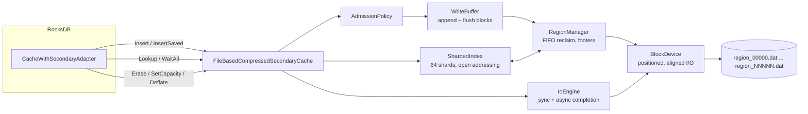

<!--
SPDX-License-Identifier: Apache-2.0
SPDX-FileCopyrightText: Copyright 2026 AVEVA
-->

# Design proposal: high-performance local-disk secondary cache

**Status:** Draft 1 — for review. Open questions in [§14](#14-open-questions-and-concerns) are
deliberately unanswered pending feedback.
**Component:** `AVEVA::RocksDB::Plugin::Core::FileBasedCompressedSecondaryCache`
**Scope constraint:** no changes to RocksDB; no changes to the plugin outside the secondary cache
and the configuration needed to construct and load it.
**RocksDB reference tree:** `C:\dev\rocksdb`, version 11.12.0 (`ROCKSDB_VERSION_INT = 11012000`).

---

## 1. Executive summary

The current secondary cache stores **one file per cache entry** in a single flat directory, writes
each entry with a *create → write → rename* sequence, reads each entry with an *open → stat → read →
close* sequence, and evicts with a *rename → delete* sequence. Every RocksDB block-cache eviction
therefore costs 3–4 filesystem **metadata** operations, and every secondary lookup costs 2 more.
Metadata operations on NTFS (and, to a lesser extent, ext4) are journalled, serialized per-directory,
and cost tens of microseconds each — one to two orders of magnitude more than the data transfer
itself for the 4–32 KiB values RocksDB actually stores. The design is metadata-bound, not
bandwidth-bound, and it also carries a global `std::shared_mutex` that is acquired 2–3 times per
operation and an `std::list` node allocation per entry.

This proposal replaces the file-per-entry substrate with a **region-structured (segment/slab) store**
modelled on Meta's CacheLib Navy `BlockCache`, Twitter's Segcache, and the log-structured flash
caches described in the Kangaroo and CacheLib literature:

- A small, fixed set of **preallocated region files**; entries are appended into an in-memory
  write buffer and flushed in large aligned I/Os. Insert cost becomes a `memcpy` plus an amortized
  fraction of one sequential write. **Zero** metadata operations per entry.
- A **sharded, open-addressing in-memory index** mapping a 64-bit key hash to a packed location,
  ~32 B/entry DRAM instead of the current ~140 B/entry (with a documented path to ~19 B).
- **Region-granular FIFO reclaim** instead of per-entry LRU eviction: eviction becomes an index
  sweep plus a buffer reset, with no filesystem operation at all, and write amplification stays
  at ~1.0.
- A **single positioned read** per lookup (`pread` / `ReadFile` with an `OVERLAPPED` offset) against
  an already-open handle, with a CRC32C integrity check, and a **real asynchronous lookup path**
  so that `SecondaryCache::Lookup(wait=false)` + `WaitAll()` actually overlaps I/O for MultiGet
  and prefetch — today `WaitAll` is a no-op and every lookup blocks the foreground thread.
- **Admission control** (probabilistic + admit-on-second-eviction) to cut SSD write volume,
  which is the dominant cost and the dominant wear factor in every published flash-cache study.
- Correct interpretation of **`Deflate`/`Inflate`** as a *RAM reservation* signal rather than a
  command to delete persistent data (§6.7) — the current implementation performs disk eviction in
  response to a memory-pressure hint, which is both expensive and semantically wrong.
- Optional **warm restart**: the current constructor unconditionally deletes the cache directory,
  so every process restart starts cold. In a stateless cloud deployment backed by Azure Blob
  Storage, a cold cache means every block is re-fetched over the network. Region-structured
  storage makes a persistent index checkpoint cheap.

Expected effect on the hot paths, to be confirmed by the benchmark harness in §11.6:
insert throughput dominated by `memcpy` rather than file creation, lookup latency reduced by
removing per-lookup `open`/`close` and the buffered-I/O double copy, and near-linear scaling with
thread count once the single global mutex is replaced with 64 shards. Quantified hypotheses are in
§8.

Nothing in the public header `FileBasedCompressedSecondaryCache.hpp` needs to change
incompatibly: the class keeps its name, its `rocksdb::SecondaryCache` surface, and its existing
constructor (§6.10). New behaviour is opt-in through an options struct and a new constructor
overload.

---

## 2. Scope, constraints and success criteria

### 2.1 In scope

| Item | Files |
|---|---|
| Secondary cache implementation | `src/Core/FileBasedCompressedSecondaryCache.cpp`, `src/Core/LruFileIndex.{hpp,cpp}`, `src/Core/ResultHandle.{hpp,cpp}` |
| New cache-private components | `src/Core/SecondaryCache/*` (new directory) |
| Public header (additive only) | `include/AVEVA/RocksDB/Plugin/Core/FileBasedCompressedSecondaryCache.hpp` |
| Configuration to construct/load the cache | new `FileBasedSecondaryCacheOptions` + optional `ObjectLibrary` factory registration |
| Tests and benchmarks for the above | `tests/AVEVA/RocksDB/Plugin/Core/*` |

### 2.2 Explicitly out of scope

- Any change under `C:\dev\rocksdb` or to the vendored RocksDB package.
- `src/Azure/**` — the Azure Page Blob filesystem.
- `src/Core/FileCache.*` — the *SST-file* download cache used by the blob filesystem. It is a
  different cache with a different unit of caching (whole SST files, downloaded asynchronously).
  It shares several of the pathologies described here and would benefit from a follow-up, but it
  is not this proposal.
- `Core::Filesystem` / `Core::LocalFilesystem` are **not modified**; they are a shared abstraction
  used by the Azure layer. The new code introduces its own, additive `BlockDevice` abstraction
  (§6.9) because whole-file `ReadFileContents`/`WriteFileAtomic` cannot express positioned I/O
  against a persistent handle.

### 2.3 Success criteria

1. **Functional parity**: all current externally-observable behaviours preserved — round trip,
   compression-type fidelity, capacity enforcement, `force_insert` admission gate, `advise_erase`,
   `kept_in_sec_cache`, statistics tickers, exception safety (`noexcept` boundary, no exception
   escapes into RocksDB).
2. **No regression in correctness under concurrency**: existing concurrency tests pass, plus new
   ones (§11.4).
3. **Measured improvement** on the benchmark harness (§11.6) against the current implementation on
   the same hardware, reported as a table of p50/p99/p99.9 latency and throughput for insert,
   lookup-hit, lookup-miss, and mixed workloads at 1/4/16/64 threads.
4. **Bounded DRAM**: index memory ≤ 0.3 % of configured disk capacity at 8 KiB mean entry size,
   explicitly accounted and reportable.
5. **Write amplification** (bytes written to device ÷ bytes inserted) ≤ 1.1 at steady state.

---

## 3. Code-level analysis of the current implementation

### 3.1 Insert path

`FileBasedCompressedSecondaryCache::Impl::Insert` →
`WriteEntry` → `LruFileIndex::ReserveCapacity` → `WriteToDisk` → `LruFileIndex::RegisterEntry`.

```text
Insert(key, obj, helper, force)
  helper->size_cb(obj)
  small_vector<char,4096> buf(dataSize)                 // ALLOC #1 + zero-fill
  helper->saveto_cb(obj, 0, dataSize, buf.data())       // COPY #1
  WriteEntry:
    KeyToFilename(key)                                  // hex expand 16B -> 32 chars
    m_lruIndex.ReserveCapacity(...)                     // LOCK #1 (global exclusive)
    CommitEvictions(...)                                //   N x (rename + delete) == 2N metadata ops
    WriteToDisk:
      m_lruIndex.MakePath(filename)                     // ALLOC #2 (std::string)
      small_vector<char,1+4096> writeBuf(storedSize)    // ALLOC #3 + zero-fill
      memcpy(writeBuf+1, buf, dataSize)                 // COPY #2
      LocalFilesystem::WriteFileAtomic:
        stagingPath = finalPath + ".N.tmp"              // ALLOC #4,#5
        ofstream open(staging)                          // METADATA OP: file create
        write(...)                                      // COPY #3 (stdio buffer) + COPY #4 (page cache)
        close()                                         // METADATA OP
        std::filesystem::rename(staging, final)         // METADATA OP
    m_lruIndex.RegisterEntry(...)                       // LOCK #2 (global exclusive)
      m_lruList.push_front(Entry{...})                  // ALLOC #6 (list node)
      m_index.insert(...)                               // possible rehash
    CommitEvictions(...)                                //   M x (rename + delete)
```

Per insert, steady state: **≥ 3 filesystem metadata operations**, **≥ 6 heap allocations**,
**4 copies of the payload**, and **2 acquisitions of a process-global exclusive mutex**, plus
2 metadata operations for each entry evicted to make room — which at steady state is ≈ 1 entry per
insert, so realistically **≈ 5 metadata operations per insert**.

Order-of-magnitude costs (to be measured, §11.6):

| Operation | NTFS (local NVMe) | ext4 |
|---|---|---|
| file create + close | 20–80 µs | 10–30 µs |
| rename | 15–50 µs | 5–20 µs |
| unlink | 15–50 µs | 5–20 µs |
| 8 KiB buffered write (no flush) | 1–3 µs | 1–3 µs |
| 8 KiB `memcpy` | ~0.4 µs | ~0.4 µs |

The payload transfer is on the order of 1 % of the cost. This is the single most important fact
about the current design: **it is a filesystem-metadata benchmark, not a cache**.

Additional per-insert issues:

- `small_vector<char, N> buf(dataSize)` **value-initializes** — every insert zero-fills the buffer
  before overwriting it with the payload. Use `default_init_t` / `uninitialized_resize`, or better,
  eliminate the intermediate buffer entirely (§6.3).
- The payload is copied twice inside the plugin (`buf` → `writeBuf`) purely to prepend a one-byte
  header. A single buffer with a reserved header prefix removes copy #2.
- `Insert` always records `kNoCompression` and stores the block **uncompressed**, despite the class
  name. `CompressedSecondaryCache` compresses on this path
  (`cache/compressed_secondary_cache.cc`), so the plugin stores 2–4× more bytes than necessary,
  wasting capacity, disk bandwidth and SSD endurance.
- Every entry lands in one flat directory. At 512 MiB / 8 KiB that is ~65 000 files; at a
  realistic node-local cache size of 100 GiB it is ~13 million files in one directory. NTFS
  directory B-tree insert/delete degrades, `$MFT` fragments badly, and the constructor's
  `remove_all` becomes minutes-long.
- Filenames are the hex-encoded key (32 chars for RocksDB's 16-byte `CacheKey`), so the key lives
  in the *directory entry*: there is no way to validate that a file's content belongs to its key,
  and there is no checksum at all.

### 3.2 Lookup path

```text
Lookup(key, helper, ctx, wait, advise_erase, stats, kept)
  KeyToFilename(key)                                   // hex expand
  m_lruIndex.MakePath(filename)                        // ALLOC (std::string)
  ReadEntryForLookup:
    m_lruIndex.TryPin(filename)                        // LOCK #1 (exclusive)
    LocalFilesystem::ReadFileContents:
      ifstream open(path, ate)                         // METADATA OP: open
      tellg / seekg                                    // 1-2 syscalls
      std::string contents(size, '\0')                 // ALLOC + zero-fill
      read()                                           // COPY (page cache -> stdio buf -> string)
      close()                                          // METADATA OP
  m_lruIndex.Touch(filename)   or  Remove(filename)    // LOCK #2 (exclusive)
  helper->create_cb(dataSlice, type, ...)              // COPY into the block object
  ~ScopedPin -> Unpin                                  // LOCK #3 (exclusive)
```

Per lookup hit: **2 metadata operations**, **3 exclusive acquisitions of the global mutex**,
2 allocations, and at least 2 payload copies. `TryPin`, `Touch`/`Remove` and `Unpin` all take
`std::lock_guard<std::shared_mutex>` — the *exclusive* lock — so the `shared_mutex` only ever
serves `GetUsage`/`GetCapacity` in shared mode. In practice the cache has a global exclusive mutex
on every operation.

`wait` is ignored and `WaitAll` is empty. RocksDB's `CacheWithSecondaryAdapter::StartAsyncLookup`
path (`cache/secondary_cache_adapter.cc`) is therefore degraded to fully synchronous, serialized
I/O: a 64-key `MultiGet` that misses the block cache performs 64 sequential `open`+`read`+`close`
round trips on the calling thread instead of 64 overlapped reads. On a device with ~100 µs latency
and QD32 capability that is roughly a 30× loss of achievable read concurrency.

### 3.3 Index and eviction

`LruFileIndex` is a classic LRU: `std::list<Entry>` + `unordered_flat_set` of list iterators.
Per-entry DRAM:

| Component | Bytes |
|---|---|
| `boost::static_string<64>` filename | 66 (+ padding) |
| `size_t size` | 8 |
| `uint32_t pinCount` | 4 |
| `std::list` node prev/next | 16 |
| allocator overhead per node (MSVC/glibc) | 16–32 |
| hash-set slot (iterator + control byte, ~0.7 load factor) | ~12 |
| **Total** | **~130–150 B/entry** |

At 100 GiB capacity with 8 KiB entries (13.1 M entries) that is **~1.8 GiB of DRAM** for the index
alone — for a cache whose purpose is to *avoid* using DRAM. CacheLib Navy's `BlockCache` index is
~12–16 B/entry precisely because this is the binding constraint on flash-cache scale.

`EvictUntilSizeLocked` scans `m_lruList` from the back with `std::find_if` looking for
`pinCount == 0`. Under concurrent lookups the tail can contain a run of pinned entries, making each
eviction O(pinned-run-length) **while holding the global lock**; worst case O(n) with the whole
cache stalled behind it.

The eviction *commit* is a rename-to-`.del` followed by a delete. The rename closes a TOCTOU window
(documented in `FileUtil::CommitEviction`) but costs a second metadata op on every eviction, and
the design comment concedes it can still move a *newly inserted* file to the graveyard, causing
spurious misses.

### 3.4 Semantic issues found while reading

1. **`Deflate`/`Inflate` delete data.** Per `include/rocksdb/secondary_cache.h` (L129–153) and
   `cache/secondary_cache_adapter.cc`, these are called by the tiered adapter to rebalance a shared
   **memory** reservation between the primary and secondary caches — potentially many times per
   second as `reserved_usage_` moves. The current implementation reduces *disk* capacity and
   synchronously evicts and deletes files. A memory-pressure signal thus triggers a burst of
   filesystem deletes and destroys cached data whose recreation costs a network round trip to Azure
   Blob Storage. See §6.7.
2. **No integrity check.** A torn, truncated, or stale-from-a-crash file is fed directly to
   `create_cb`; the only defence is a `contents.empty()` test. RocksDB treats the secondary cache as
   a trusted source. Add CRC32C (§6.1.3).
3. **No restart persistence.** `Impl::Impl` calls `m_fs->DeleteDir(m_cacheDir)` unconditionally.
4. **`Insert` ignores `helper->role`.** Filter and index blocks are far more valuable per byte than
   data blocks and should be preferentially admitted and retained; RocksDB exposes `CacheEntryRole`
   on the helper for exactly this (cf. `do_not_compress_roles` in `CompressedSecondaryCache`).
5. **`ReserveCapacity` temporarily mutates `m_currentSize`** and restores it before returning, but
   between `ReserveCapacity` and `RegisterEntry` the accounting is knowingly inconsistent; the
   comment acknowledges that concurrent overshoot is corrected later. Region accounting (§6.5)
   removes this class of problem because capacity is accounted in whole regions.
6. **`Erase`, `Lookup(advise_erase)` and eviction all perform synchronous filesystem work on the
   caller's thread** — and RocksDB calls `Insert` from the eviction handler of a *foreground*
   read/write thread (`CacheWithSecondaryAdapter::EvictionHandler`). The plugin therefore injects
   filesystem-metadata latency directly into RocksDB `Get`/`Put` latency.

---

## 4. Alignment with how RocksDB actually uses a `SecondaryCache`

Established from the reference tree (`C:\dev\rocksdb`, 11.12.0). This is the contract the new design
must satisfy.

| Fact | Source | Design consequence |
|---|---|---|
| `Insert` is invoked from `CacheWithSecondaryAdapter::EvictionHandler`, inline on the thread that caused the primary eviction, *after* the shard mutex is released. | `cache/secondary_cache_adapter.cc` ≈L130–160 | Insert must be **non-blocking**: copy into a write buffer and return. No filesystem op on the caller's thread. |
| The `obj` passed to `Insert` is **borrowed**; valid only for the duration of the call. | `include/rocksdb/secondary_cache.h` L76–88 | `saveto_cb` must run synchronously inside `Insert`; only the *bytes* may be deferred. |
| `force_insert` is an admission hint, and `Status::OK()` does **not** imply admission. | ibid. | Free to drop entries under an admission policy and still return OK. `force_insert` bypasses the probabilistic gate but not the hard size limit. |
| `Lookup(wait=false)` may return a pending handle; `WaitAll` blocks until ready. Used by `StartAsyncLookup`/`Cache::WaitAll` for MultiGet and prefetch. | `cache/secondary_cache_adapter.cc` ≈L350–480; `cache/cache.cc` L153–185 | Implement a genuine async path; the largest single latency win for MultiGet. |
| `advise_erase` is `found_dummy_entry`: the primary cache holds a recency marker, so the secondary copy may be dropped. `kept_in_sec_cache` tells the adapter whether to promote with `helper` or `helper->without_secondary_compat`. | `cache/secondary_cache_adapter.cc` ≈L170–250 | Erase must be an **index-only** operation. The region design gives this for free. |
| `CompressedSecondaryCache` inserts **dummy entries** to record recency and avoid re-admission churn. | `cache/compressed_secondary_cache.cc` | Adopt the same trick as the cheap half of the admission policy (§6.3.2): a ghost index entry with no payload. |
| The same key may be inserted concurrently by several threads; the API promises no single-flight. | RocksDB trace §5 | Index publication must be atomic and last-writer-wins, with self-validating records so a stale location can never be mistaken for a fresh one. |
| Values are arbitrary-size and unaligned, typically 1 KiB–64 KiB (`block_size` default 4 KiB; index/filter blocks much larger). | `table/block_based/block_based_table_reader.cc` | Support arbitrary lengths; align *placement*, not content. Oversized entries need a rejection path (§6.1.4). |
| `size_cb`/`saveto_cb` support **chunked** serialization (`from_offset`, `length`). | `include/rocksdb/advanced_cache.h` | Can serialize directly into the region write buffer with no intermediate copy, even across a flush boundary. |
| `create_cb` borrows `data` and must be assumed reentrant/concurrent. | ibid. | The read buffer must outlive the `create_cb` call and be per-call, never shared mutable state. |
| Exceptions must not escape any override. | `include/rocksdb/secondary_cache.h` L60–65 | Keep the existing `noexcept` boundary and `CurrentExceptionToStatus` discipline. |
| `SECONDARY_CACHE_HITS` plus role-specific `..._{DATA,INDEX,FILTER}_HITS` are recorded by the adapter's `Promote`, but recording them in the implementation (as today) matches `CompressedSecondaryCache`. | `cache/secondary_cache_adapter.cc` | Keep `RecordHitStats`; add our own admit/reject/evict counters (§6.11). |
| `Deflate`/`Inflate` manage a **RAM reservation**, not persistent capacity. | `include/rocksdb/secondary_cache.h` L129–153 | §6.7. |
| `SecondaryCache` has **no** required enumeration/introspection API. | RocksDB trace §6 | We are free to choose the index representation. |

---

## 5. Distilled learnings from prior art

The survey behind this section covered Meta CacheLib Navy (`BlockCache`, `BigHash`, device layer,
job scheduler, admission policies, persist/recover), Kangaroo (SOSP'21), Flashield (NSDI'19),
Segcache (NSDI'21), S3-FIFO (SOSP'23), SIEVE (NSDI'24), W-TinyLFU/Caffeine, Ceph BlueStore/BlueFS,
ScyllaDB/Seastar, Aerospike hybrid memory, Apache Ignite, Alluxio, Netflix EVCache/Moneta,
Redis Auto Tiering, and RocksDB's own `CompressedSecondaryCache` / `TieredSecondaryCache`.
Full source list in §15.

### 5.1 Design rules

| # | Rule | Origin / evidence |
|---|---|---|
| L1 | Never use one file per cached object. Use a small number of large, preallocated files (regions/segments) and manage the space yourself. | Navy `RegionManager` ("size class or stack allocator", `RegionManager.h:65`); Segcache 1 MiB segments; Aerospike 8 MiB write-blocks. NTFS charges a fixed ~1 KiB MFT entry per file plus B+-tree directory-index insert/lock cost. |
| L2 | Make the write path an append into a memory buffer; flush in large, aligned, sequential I/Os. | Navy `Region::openAndAllocate` bump allocation with an attached in-memory `Buffer` (`Region.h:98-101,143-190`); Aerospike append-only write-blocks; Flashield batches into ~512 MiB sequential segments. |
| L3 | Evict at **region granularity**, not object granularity. Eviction becomes an index sweep, not I/O. | Navy documents the region-reclaim/item-eviction split explicitly as the mechanism that amortizes flash GC and avoids per-item write amplification (`RegionManager.h:299-303`, `BlockCache.cpp:673-736`). |
| L4 | FIFO region reclaim with *reinsertion* of still-hot objects beats strict LRU on flash, because LRU on flash costs random writes. | CacheLib's LRU→FIFO region-eviction change cut **device-level WA 1.5× → 1.05×** (15% fewer NAND writes/sec) at a small app-level WA cost (OSDI'20 p.780). Navy `HitsReinsertionPolicy` / `PercentageReinsertionPolicy` restore the lost recency signal. |
| L5 | DRAM index cost per object is the scaling limit; store only a key hash plus a packed address, and validate the full key against the on-disk record. | Navy `Index::ItemRecord` is **8 B**, `PackedItemRecord` **5 B** (`Index.h:49-67,184-193`); CacheLib LOC index = 0.01–0.61% of cache size (OSDI'20 p.775/780); Flashield <4 B/object; FASTER 8 B/key; Segcache ~5 B/object. Our ~32 B/entry v1 target is conservative against these, with a documented path to ~19 B. |
| L6 | Apply **admission control**. Admitting everything burns endurance and evicts useful data for one-hit wonders. | CacheLib measured its uncontrolled write rate at **50% above** the sustainable device rate, and its advanced admission policy cut flash write rate **44%** with no hit-ratio loss (OSDI'20 Appendix C). Flashield's median cumulative WA is **0.5–0.54×** vs 2.85× (RIPQ) / 3.67× (victim cache). RocksDB's own dummy-entry trick is the same idea at zero cost. |
| L7 | Checksum the record header **independently** from the payload. Validate the header first; a header-checksum failure during a region scan should abort the rest of that region, while a payload-only failure is non-fatal (skip the item, keep iterating). | Navy `BlockCache.cpp:535,560,654-661,673-736,1025-1033`; BigHash per-bucket `checksum_` + `generationTime_` (`Bucket.h:105-107`). |
| L8 | Keep very small objects out of the big log if they dominate — a set/bucket store with per-bucket Bloom filters is far more DRAM- and space-efficient for objects ≪ device page. | Navy BigHash: **no per-item DRAM index**, 4 KiB buckets, Bloom filter sized **16 B per ~25 entries with 4 hashes**, skipping >90% of useless flash reads (`BigHash.h:47-62,66`; `NavySetup.cpp:127-134`). Cost: ~6.5× app-level WA because every insert rewrites a full 4 KiB bucket. Kangaroo's KLog→KSet buffering (flush only once ≥2 objects collide on a set) cuts that from 17.9× to **5.8×** alwa. |
| L9 | Use positioned I/O on persistent handles; never open/close per operation. | Universal; Navy holds one `Device` for the lifetime of the cache. |
| L10 | Overlap reads: NVMe throughput lives at queue depth. Expose and use the async lookup API. | Navy `ThreadPoolJobScheduler` sharded by key hash; Seastar's 2-D (IOPS+bandwidth) fair-queue IO scheduler. |
| L11 | Shard the index. A single global mutex caps throughput and collapses under contention. | Navy shards both index and job queues by key hash; RocksDB's own `ShardedCache`. S3-FIFO reports **6×** and SIEVE **2×** the throughput of optimized 16-thread LRU purely from cheaper hit-path bookkeeping. |
| L12 | Prefer dropping the cache to serving stale or corrupt data; recovery *correctness* beats recovery *completeness*. | Navy `BlockCache::persist/recover` validates base offset, cache size, alloc alignment, checksum config and version, and **wipes on any mismatch** — it deliberately does *not* attempt a scan-based rebuild (`BlockCache.cpp:1574-1623`). |
| L13 | Decouple *disk* capacity from *DRAM* capacity in the API surface; they are governed by different signals. | RocksDB routes `Deflate`/`Inflate` through a `ConcurrentCacheReservationManager` — a RAM-reservation signal, deliberately lighter than `SetCapacity`. |
| L14 | Track write amplification as **two** numbers: application-level (bytes charged vs bytes written) and device-level (host writes vs NAND writes). They diverge, and different levers fix each. | CacheLib SOC: **~6.5× app-level but only 1.1–1.4× device-level** (with 50% overprovisioning) — OSDI'20 p.780. |
| L15 | Batch the index/metadata updates the same way you batch the data. | Segcache segment-granularity metadata; Navy region footers. |
| L16 | Derive the admission rate from an explicit **endurance budget** (target DWPD × device capacity → bytes/day), not from empirical tuning, and drive it with a damped multiplicative feedback controller. | Navy `DynamicRandomAP`: `probabilityFactor *= clamp(target/observed, ±25%/60 s window)`, globally clamped to [0.001, 10.0], with a base curve `(k/log2(size))^exp` that penalizes large items, and a **deterministic hash of the key** (not an RNG) so the admission decision for a key is stable (`DynamicRandomAP.cpp:99-129,159-224`). Kangaroo derives 62.5 MB/s from a 3-DWPD 1.92 TB drive; Aerospike publishes a WA-vs-utilization curve of **2× @ 50%, 4× @ 75%, 10× @ 90%**. |
| L17 | Overprovision the device beyond logical cache capacity if you want low single-digit device-level WA. This is a deliberate production tradeoff, not waste. | CacheLib runs SOC with **50% overprovisioning**; Kangaroo measures device WA ≈1× at 50% utilization vs ≈10× at 100%. |
| L18 | Use `O_DIRECT` / `FILE_FLAG_NO_BUFFERING` with hard alignment of buffer address, transfer size **and** file offset to the *queried* logical sector size. Never assume 512 B. | Navy asserts `maxWriteSize_ % ioAlignmentSize_ == 0` and opens `O_RDWR\|O_CREAT\|O_DIRECT`, falling back only on `EINVAL` (`Device.h:79-232`, `Device.cpp:1163-1173`). Windows imposes the identical constraint; query via `IOCTL_STORAGE_QUERY_PROPERTY`/`StorageAccessAlignmentProperty`. 512e devices pay a read-modify-write penalty for misaligned sub-4K writes. |
| L19 | Avoid `mmap` for the cache data path. | Reintroduces uncontrolled page-cache behaviour, synchronous page-fault stalls that block a whole shard in async designs, and is largely incompatible with `O_DIRECT`. Seastar/ScyllaDB rationale; RocksDB's own `allow_mmap_reads` bypasses its block cache and defaults to `false`. |
| L20 | If reclaimed space is returned via sparse files / hole punching, do it in **large sequential batches**, never scattered ranges, and issue TRIM so device GC can skip copy-out. | NTFS has shipped hotfixes for extent-count failures (error 665) on heavily fragmented sparse files. `FALLOC_FL_PUNCH_HOLE` on Linux; `FSCTL_SET_SPARSE` + `FSCTL_SET_ZERO_DATA` + `FSCTL_FILE_LEVEL_TRIM` on Windows. |
| L21 | Enforce **per-key** write ordering via a sharded, key-hashed job queue rather than a global lock, once async writes are in flight. | Navy `OrderedThreadPoolJobScheduler` spools same-key jobs specifically to stop an insert/remove pair for one key landing out of order (`ThreadPoolJobScheduler.h:117-201`). |
| L22 | Gate promotion on an explicit hotness signal rather than promoting unconditionally, and do **not** implement demotion between tiers. | RocksDB `kAdmPolicyAllowCacheHits` forces insertion only if the block was actually hit in the primary before eviction; `TieredSecondaryCache` states outright that blocks evicted from a tier are discarded, never written back up. Navy's `NvmCache::onGetComplete` promotes on flash hit. |
| L23 | Consider a modern FIFO-based eviction algorithm (S3-FIFO, SIEVE) over classic LRU for in-memory hot-item tracking: comparable-or-better hit ratios with a *non-mutating* hit path. | S3-FIFO: lowest mean miss ratio on 10/14 datasets over 6,594 traces, 6× the throughput of 16-thread optimized LRU (SOSP'23). SIEVE: one "visited" bit per object, no reordering on hit, ~2× LRU throughput (NSDI'24). |
| L24 | Order tier lookups cheapest/most-selective first (DRAM → compact-index tier → Bloom-gated tier) and do not reverse it. | CacheLib's AMAT model: DRAM ≈500 ns, LOC ≈1 µs, SOC ≈2.6 µs; reversing LOC/SOC adds several microseconds (OSDI'20 Appendix A). |
| L25 | Align object packing to the device geometry, but allow sub-page write buffering to cut internal fragmentation. | CacheLib cut CDN fragmentation **7% → 2%** by allowing 512 B-aligned rather than always-4 KiB allocation (OSDI'20 §5.2), and cut P99 flash read latency **25%** via readmission + write-buffer changes (§5.3). |

### 5.2 Published numbers worth calibrating against

| Metric | Value | Source |
|---|---|---|
| Navy `BlockCache` DRAM index entry | 5 B packed / 8 B unpacked | CacheLib `Index.h` |
| CacheLib LOC index overhead | 0.01–0.61% of cache size | OSDI'20 p.775/780 |
| CacheLib whole-DRAM-tier per-item metadata | 31 B/item | OSDI'20 Table 1 |
| Segcache per-object metadata | ~5 B (vs Memcached 56 B) | NSDI'21 |
| Flashield DRAM index | <4 B/object | NSDI'19 |
| Kangaroo total system DRAM | ~7 bits/object | SOSP'21 p.246 |
| Aerospike primary index | 64 B/record | Aerospike docs |
| SOC app-level / device-level WA | ~6.5× / 1.1–1.4× | OSDI'20 p.780 |
| LOC device WA, LRU → FIFO | 1.5× → 1.05× | OSDI'20 p.780 |
| Kangaroo alwa: naive / set-assoc / Kangaroo | 40× / 17.9× / 5.8× | SOSP'21 p.243–247 |
| Flashield cumulative WA, median | 0.5–0.54× (vs RIPQ 2.85×) | NSDI'19 Table 5 |
| Admission policy flash-write reduction | 44% (CacheLib), 42.5% (Kangaroo prod) | OSDI'20 App. C; SOSP'21 Fig. 13 |
| Aerospike WA vs defrag low-water-mark | 2× @ 50%, 4× @ 75%, 10× @ 90% | Aerospike docs |
| Navy BigHash Bloom filter sizing | 16 B / ~25 entries, 4 hashes, <10% FP | `NavySetup.cpp:127-134` |
| AMAT per tier | DRAM ~500 ns, LOC ~1 µs, SOC ~2.6 µs | OSDI'20 App. A |

### 5.3 What the survey did *not* find

- **No public in-tree or well-documented third-party local-flash `rocksdb::SecondaryCache` implementation exists.** RocksDB upstream ships only the interface, the in-memory `CompressedSecondaryCache`, and the `TieredSecondaryCache` stacking adapter; the `nvm_sec_cache` slot in `TieredCacheOptions` is explicitly left for external implementations. The 2021 RocksDB design blog states Meta's internal plan was "to use CacheLib with a wrapper to provide the plug-in implementation." **This work has no upstream reference implementation to copy — which raises the value of the test plan in §11.**
- No citable public `db_bench --secondary_cache_uri` benchmark numbers (the flag exists only in `db_stress`/`cache_bench`/`db_crashtest.py`, not `db_bench_tool.cc`). Treat any web-sourced numbers as unverified.
- S3-FIFO's and SIEVE's exact headline percentages were retrieved from abstracts/summaries rather than hand-verified PDF text — directionally correct, not block-quotable.
- RocksDB's deprecated `PersistentCache` (exposed at the table-reader level, no admission control) is worth reading as an **anti-pattern**: it was explicitly superseded by the current design that hides the secondary tier behind `Cache`.

---

## 6. Proposed architecture



### 6.1 On-disk layout

#### 6.1.1 Files

```text
<cacheDir>/
  CACHE            # 4 KiB superblock: magic, format version, config fingerprint, instance UUID
  region_00000.dat # fixed-size region file, default 64 MiB
  region_00001.dat
  ...
  INDEX            # optional index checkpoint written on clean shutdown (§6.8)
```

`regionCount = ceil(capacityBytes / regionSizeBytes)`. Region files are **preallocated** at
construction (`SetEndOfFile`, and `SetFileValidData` where the privilege is held, on Windows;
`fallocate` on Linux) so steady state never pays block-allocation cost and the cache cannot fail
mid-run because the volume filled up.

#### 6.1.2 Region layout

A region is an append log of records written in `flushBlockSize` (default 1 MiB) aligned chunks.
The last 4 KiB is a footer, written when the region is sealed, listing `(keyHash, offset, length)`
for every record. The footer makes index reconstruction and reclaim sweeps cheap (§6.5, §6.8).

```text
+-------------------------------------------------------------+
| record 0 | record 1 | ... | record k | free | FOOTER (4 KiB) |
+-------------------------------------------------------------+
 0                                             regionSize-4096
```

#### 6.1.3 Record format

All integers little-endian (`boost::endian` is already a dependency).

| offset | size | field | notes |
|---|---|---|---|
| 0 | 4 | `magic` | `0x31435641` ('AVC1') — cheap torn-write sentinel |
| 4 | 1 | `formatVersion` | currently 1 |
| 5 | 1 | `compression` | `rocksdb::CompressionType` of the payload |
| 6 | 1 | `sourceTier` | `rocksdb::CacheTier` that produced the payload |
| 7 | 1 | `flags` | bit0 = tombstone/ghost; bit1 reserved for multi-region spill |
| 8 | 8 | `keyHash` | 64-bit hash of the full RocksDB key |
| 16 | 4 | `keyLen` | length of the exact key bytes that follow |
| 20 | 4 | `payloadLen` | bytes of payload after the key |
| 24 | 4 | `payloadCrc` | CRC32C of the payload |
| 28 | 4 | `headerCrc` | CRC32C of bytes `[0,28)` plus the key bytes |
| 32 | `keyLen` | `key` | exact RocksDB key bytes (16 for block-cache keys) |
| 32+kl | `payloadLen` | `payload` | serialized, optionally compressed block |
| … | pad | | to a `kRecordAlign` (64 B) boundary |

Overhead is 48 B for a 16-byte key: 0.15–1.2 % on a 4–32 KiB block. Compare with the current design,
which has ~1 byte of in-file overhead but pays one NTFS cluster (4 KiB minimum) plus an MFT record
per entry.

Storing the full key makes every record **self-identifying**: a 64-bit index hash collision becomes
a detected miss rather than silent corruption, the index can be rebuilt by scanning, and a
misdirected or stale read is caught (L7).

#### 6.1.4 Oversized entries

A record that does not fit in a region is **rejected** — `Insert` returns `Status::OK()` without
admitting, which the API explicitly permits (§4). Entries larger than `maxEntrySize`
(default `regionSize / 4`) are rejected early so one entry cannot waste a region. With a 64 MiB
default region this is effectively unreachable for block-cache entries.

A record may straddle a `flushBlockSize` boundary inside a region — that is just buffering — but
never a region boundary.

### 6.2 In-memory index

```text
ShardedIndex
  └── Shard[64]                 (selected by a mixing step over keyHash)
        ├── std::mutex
        └── open-addressing map: keyHash -> Location
```

```cpp
struct Location {           // 14 bytes of fields, 16 with natural padding
    uint32_t regionId;
    uint32_t offsetInAlignUnits;   // record offset / 64
    uint16_t lengthInAlignUnits;   // record length / 64   (covers 4 MiB; widen if maxEntrySize grows)
    uint16_t generation;           // region reclaim generation
    uint8_t  hitCount;             // saturating, for reinsertion policy
    uint8_t  flags;                // tombstone/ghost
};
```

- 20 bits of `offsetInAlignUnits` address a 64 MiB region exactly; the field is kept 32-bit for
  simplicity and future-proofing.
- A slot is the 8-byte `keyHash` plus a 16-byte `Location` = **24 B**; at a 0.75 load factor that is
  **~32 B per live entry** versus ~140 B today — a **4–4.5×** reduction. For a 100 GiB cache at
  8 KiB entries: ~420 MiB instead of ~1.8 GiB.
- Navy achieves 5–8 B per entry (L5) by packing the address into a single `uint32_t` and encoding
  size exponentially. If the DRAM figure turns out to matter, §10 phase 4 can adopt the same trick:
  dropping `regionId`/`offsetInAlignUnits` to one packed `uint32_t` address and `lengthInAlignUnits`
  to a 6-bit exponent yields a 6-byte `Location`, i.e. ~19 B/entry at 0.75 load. It is deliberately
  **not** in v1 because it trades debuggability and a clean invariant (`generation`) for DRAM we
  probably have.

**Implementation choice.** Start with `boost::unordered_flat_map<uint64_t, Location>` per shard
(already a dependency, no new code to get wrong). Hand-roll a packed open-addressing table only if
profiling shows it matters (§10 phase 4).

**Collisions.** The 64-bit hash is the map key, so two distinct RocksDB keys can share a slot. The
on-disk record carries the full key, so the read path compares and returns a miss on mismatch.
At 13 M entries the collision probability is ~4 × 10⁻⁶ over the cache's lifetime, and the
consequence is one extra device read then a miss — never corruption. Counted as
`missesKeyMismatch`.

**Recency metadata.** Region-granular FIFO needs no per-entry LRU state, which is exactly why it is
cheap. For the reinsertion policy we keep a saturating 8-bit `hitCount` updated on lookup — no
list, no pointers, no per-access pointer writes.

### 6.3 Write path

#### 6.3.1 Flow

```cpp
rocksdb::Status Insert(const rocksdb::Slice& key, rocksdb::Cache::ObjectPtr obj,
                       const rocksdb::Cache::CacheItemHelper* helper, bool forceInsert) noexcept {
    if (!helper || !helper->IsSecondaryCacheCompatible()) return rocksdb::Status::OK();
    const size_t valueSize = helper->size_cb(obj);
    if (valueSize == 0) return rocksdb::Status::OK();

    if (!m_admission.ShouldAdmit(keyHash, helper->role, valueSize, forceInsert)) {
        m_stats.insertsRejectedByPolicy.fetch_add(1, std::memory_order_relaxed);
        return rocksdb::Status::OK();                    // admitted == false is legal
    }

    ThreadScratch& scratch = GetScratch();               // thread_local, grows, never shrinks
    scratch.EnsureCapacity(valueSize);
    if (auto s = helper->saveto_cb(obj, 0, valueSize, scratch.data()); !s.ok()) return s;

    auto [payload, type] = MaybeCompress(scratch.span(valueSize), helper->role);
    return AppendRecord(key, payload, type, rocksdb::CacheTier::kVolatileTier);
}
```

`AppendRecord` is the single mutating primitive:

```cpp
rocksdb::Status AppendRecord(const rocksdb::Slice& key, std::span<const std::byte> payload,
                             rocksdb::CompressionType type, rocksdb::CacheTier tier) noexcept {
    const uint32_t recLen = static_cast<uint32_t>(RecordSize(key.size(), payload.size()));
    if (recLen > m_opts.maxEntrySize) { m_stats.insertsRejectedTooLarge++; return rocksdb::Status::OK(); }

    // 1. Reserve space in an open region. Fast path is one relaxed fetch_add.
    RegionReservation res;
    if (!m_regions.Reserve(recLen, res)) {            // no buffer available -> drop, never block
        m_stats.insertsDroppedNoBuffer++;
        return rocksdb::Status::OK();
    }

    // 2. Encode directly into the region's write buffer. One payload copy, total.
    EncodeRecord(res.buffer, ToBytes(key), payload, type, tier, res.keyHash);

    // 3. Publish. Last writer wins for duplicate keys.
    m_index.Upsert(res.keyHash,
                   Location{res.regionId, res.offset / kRecordAlign,
                            static_cast<uint16_t>(recLen / kRecordAlign), res.generation, 0, 0});

    // 4. Account; hand a completed flush block to the IoEngine if this append filled one.
    m_regions.Publish(res);
    return rocksdb::Status::OK();
}
```

Cost on the caller's (RocksDB foreground) thread: one `fetch_add`, one payload `memcpy`, one
sharded mutex acquisition, and — when compression is enabled — the compressor. **No syscall, no
allocation, no global lock.**

`InsertSaved` takes the same path, skipping `saveto_cb` and `MaybeCompress` and preserving the
caller's `CompressionType` and `CacheTier` verbatim (existing round-trip tests assert this).

#### 6.3.2 Admission policy

| Policy | Behaviour | Cost |
|---|---|---|
| `kAdmitAll` | today's behaviour; the baseline | — |
| `kProbabilistic` | admit with probability `p` unless `force_insert` | one thread-local PRNG draw |
| `kSecondChance` (**recommended default**) | the first eviction of a key writes a *ghost* index slot with no payload; only the second eviction writes data. Mirrors `CompressedSecondaryCache`'s dummy-entry trick. | one index upsert |
| `kRoleWeighted` | always admit `kFilterBlock`/`kIndexBlock`; apply the above to `kDataBlock` | one branch |
| `kDynamicRandom` | adjust `p` in a control loop to hold a configured device write rate (MB/s) | one relaxed atomic read |

`force_insert == true` bypasses probabilistic and second-chance gating. RocksDB sets it under
`kAdmPolicyAllowCacheHits` / `kAdmPolicyAllowAll` for entries that were *hit* in the primary cache —
exactly the entries worth keeping.

Ghost entries occupy an index slot and zero disk bytes, are never returned as hits
(`flags.tombstone`), and are swept when a shard's ghost count exceeds a threshold.

**`kDynamicRandom` concretely.** Navy's `DynamicRandomAP` is the reference design and is worth
copying almost verbatim, because the naive version (linear feedback on an RNG draw) oscillates:

```cpp
// Target derived from endurance, not tuned empirically (L16):
//   targetBytesPerSec = targetDwpd * deviceCapacityBytes / 86400
//
// Per-window (default 60 s) update:
probabilityFactor_ = std::clamp(
      probabilityFactor_ * std::clamp(targetRate / observedRate, kMinChange /*0.75*/,
                                                                  kMaxChange /*1.25*/),
      kLowerBound /*0.001*/, kUpperBound /*10.0*/);

// Base curve penalizes large items, so a big block must be "worth more" to get in:
const double baseProb = std::pow(baseMultiplier / std::log2(double(size)), probExponent);

// Deterministic in the key, NOT an RNG: the same key gets the same verdict within a window,
// so a hot key that is repeatedly evicted is not admitted by luck on the 5th try.
return Mix(keyHash, windowSeed_) < std::clamp(baseProb * probabilityFactor_, 0.0, 1.0);
```

Three details that matter and are easy to get wrong:
1. **Multiplicative, damped, and clamped.** `±25 %` per window with a global `[0.001, 10.0]` bound.
2. **Deterministic hash rather than a PRNG draw.** Otherwise repeated eviction of the same key
   becomes a Bernoulli trial that eventually succeeds, defeating the policy.
3. **Size-penalizing base curve.** Admitting a 256 KiB entry costs 64× the endurance of a 4 KiB one
   for the same index slot.

`kSecondChance` remains the default because it costs nothing and needs no configuration;
`kDynamicRandom` is the answer to Q14 once a DWPD budget exists.

#### 6.3.3 Buffering and flushing

Each open region owns a small ring of `writeBuffersPerRegion` (default 2) buffers of
`flushBlockSize` (default 1 MiB) each. Records are appended into the active buffer; when the write
cursor crosses a block boundary the completed buffer is handed to the `IoEngine` and the next
buffer becomes active. Steady-state DRAM for buffers is
`openRegions × writeBuffersPerRegion × flushBlockSize` — 2 MiB with the defaults.

A record is therefore readable from the **buffer** until its block reaches the device, and from the
**device** afterwards. The read path handles both (§6.4, "read-your-writes"). Navy has the same
requirement and solves it the same way.

`openRegions` (default 1; 2–4 recommended on NVMe) spreads concurrent writers across independent
append streams, reducing `fetch_add` contention and increasing device parallelism.

When every buffer is in flight, `Insert` **drops** the entry rather than stalling: the cache must
never add latency to the read path it exists to accelerate. Counted as `insertsDroppedNoBuffer`.
**Open question Q6.**

#### 6.3.4 Why no per-key ordered job queue

Navy needs an `OrderedThreadPoolJobScheduler` that spools jobs by key hash, because in Navy the
*index publication itself* happens asynchronously inside the write job — so a concurrent
`insert(k)` / `remove(k)` pair can complete out of order and leave the index pointing at data the
caller believes was erased.

Our design sidesteps this entirely: **the index entry is published synchronously, inside `Insert`,
before the buffer is ever handed to the `IoEngine`.** The only asynchronous step is moving already
committed bytes to the device, and the read path can already serve those bytes from the buffer.
Consequently:

- `Insert(k)` then `Erase(k)` on one thread is strictly ordered, with no in-flight window.
- Two concurrent `Insert(k)` calls resolve last-writer-wins at the index; both records exist on
  disk, one is unreachable, and the region reclaim sweep drops the unreachable one because its
  `(regionId, offset)` no longer matches the index. §6.5 already requires this check.
- `Erase(k)` racing an `Insert(k)` is a genuine tie. Either outcome is correct for a cache; the
  self-validating record format means the loser can never be *misread*, only redundantly present.

This is a real simplification bought by the synchronous-index choice, and it is worth stating
explicitly so a future change to asynchronous index publication knows what it would be giving up.

### 6.4 Read path

```cpp
std::unique_ptr<rocksdb::SecondaryCacheResultHandle>
Lookup(const rocksdb::Slice& key, const rocksdb::Cache::CacheItemHelper* helper,
       rocksdb::Cache::CreateContext* ctx, bool wait, bool adviseErase,
       rocksdb::Statistics* stats, bool& kept) noexcept {
    kept = false;
    if (!helper || !helper->IsSecondaryCacheCompatible()) return nullptr;

    const uint64_t h = HashKey(key);
    Location loc;
    if (!m_index.FindAndTouch(h, loc)) { m_stats.missesIndex++; return nullptr; }  // no I/O on a miss

    RegionReadGuard guard(m_regions, loc.regionId, loc.generation);  // O(1) reader pin
    if (!guard) { m_stats.missesRegionReclaimed++; return nullptr; }

    if (wait || !m_opts.enableAsyncLookup) {
        auto buf = ReadRecordSync(loc, guard);        // one pread, or a memcpy from the write buffer
        return FinishLookup(buf, key, loc, helper, ctx, adviseErase, stats, kept);
    }
    auto handle = std::make_unique<AsyncResultHandle>(this, key, loc, std::move(guard),
                                                      helper, ctx, adviseErase, stats);
    m_io.SubmitRead(handle->Request());               // returns immediately, handle is pending
    return handle;
}
```

`FinishLookup` validates before it trusts anything:

```text
magic / formatVersion            -> miss, drop the index slot  (missesCrc)
bounds-check keyLen, payloadLen against the buffer
headerCrc over [0,28) + key      -> miss, drop the slot        (missesCrc)
keyLen == key.size() && memcmp   -> miss, keep the slot        (missesKeyMismatch: hash collision)
payloadCrc over the payload      -> miss, drop the slot        (missesCrc)
create_cb(payload, hdr.compression, hdr.sourceTier, ctx, nullptr, &obj, &charge)
RecordHitStats(stats, helper->role)
kept = !adviseErase;  if (adviseErase) m_index.Remove(h);      // index-only, no I/O
```

Key properties:

- **One positioned read.** The index carries the record length, so a single `pread` of the exact
  range suffices — no `stat`, no second read, no open, no close.
- **Direct I/O alignment.** With `FILE_FLAG_NO_BUFFERING` / `O_DIRECT`, offset, length and buffer
  address must all be device-block aligned; `kRecordAlign = 64` is insufficient, so the read is
  widened to the enclosing 4 KiB range and the payload sliced out (≤ 8 KiB of extra transfer).
  Whether to use direct I/O at all is **open question Q1**: buffered I/O gives a free second-level
  cache in the OS page cache — arguably a feature for a secondary cache — at the cost of
  double-caching and unpredictable memory pressure inside a container memory limit.
- **Read-your-writes.** If the location is inside an unflushed write buffer, the data is served by
  `memcpy` from that buffer under the region's reader guard.
- **Pinning against reclaim.** The reclaimer flips the region to `Reclaiming`, removes all of its
  index entries *first* (so no new reader can arrive), then waits for `activeReaders == 0`. The
  wait is therefore bounded by one in-flight I/O. This replaces the per-entry `pinCount` plus O(n)
  scan with a single O(1) per-region atomic counter.
- **`advise_erase` costs nothing**: one index removal, no filesystem operation (versus a rename
  plus a delete today).
- **Optional promotion.** `reinsertionPolicy` may re-append a hot record into the open region so it
  survives its region's reclaim (§6.5).

#### 6.4.1 Asynchronous lookup and `WaitAll`

```cpp
class AsyncResultHandle final : public rocksdb::SecondaryCacheResultHandle {
  public:
    bool IsReady() override { return m_done.load(std::memory_order_acquire); }
    void Wait() override {
        m_done.wait(false, std::memory_order_acquire);   // C++20 atomic wait, no condvar alloc
        Finish();                                        // validate + create_cb on the waiter's thread
    }
    rocksdb::Cache::ObjectPtr Value() override { return m_obj; }
    size_t Size() override { return m_charge; }
  private:
    std::atomic<bool> m_done{false};
    // ... buffer, Location, RegionReadGuard, helper, ctx, stats
};

void WaitAll(std::vector<rocksdb::SecondaryCacheResultHandle*> handles) noexcept {
    for (auto* h : handles) h->Wait();
}
```

The `IoEngine` completion path sets `m_done` and notifies; validation and `create_cb` run in
`Wait()` on the caller's thread. That keeps the I/O threads free and avoids block-construction CPU
starving the completion path — **open question Q7** covers the alternative.

Because `Lookup(wait=true)` stays fully synchronous and `WaitAll` is trivially correct for
already-ready handles, the async path ships behind `enableAsyncLookup`, defaulted off until
benchmarked (§10 phase 4).

### 6.5 Eviction and region reclaim

At steady state all regions are full. To open a new region, the `RegionManager` reclaims the oldest:

```text
1. victim = oldest sealed region                       [policy: kFifo | kLruRegion]
2. read its 4 KiB footer -> list of (keyHash, offset, len)
3. if reinsertion is enabled: re-append entries whose hitCount >= threshold into the open region
4. for each footer entry: RemoveIfInRegion(keyHash, victimId, victimGeneration)
     (a newer copy of the same key in another region must survive)
5. wait for activeReaders == 0
6. cursor = 0; ++generation; state = Open
```

Cost: one 4 KiB read plus *k* index removals for a whole 64 MiB region. At 8 KiB entries that is
~8 000 removals amortized over ~8 000 inserts — roughly **one index operation per insert and zero
filesystem operations**, versus two metadata operations per evicted entry today.

**Generation counters** make stale index entries harmless: if a region has been reclaimed since the
`Location` was published, the generation mismatches and the read is a miss. Combined with the
in-record key check, the index is safe under any interleaving.

**Why FIFO and not LRU?** (L4) LRU on a log-structured store requires either random writes to move
entries or per-entry metadata plus a defragmentation pass. Published results (CacheLib, Kangaroo,
S3-FIFO/SIEVE) show FIFO-with-reinsertion captures most of LRU's hit ratio at a fraction of the
write amplification. The delta is workload-specific, so it is an explicit **measurement task**
(§11.6) and **open question Q2**; `kLruRegion` (reclaim the least-recently-*read* region) is a
one-line policy change costing 8 bytes per region.

### 6.6 Compression

The class is named `FileBasedCompressedSecondaryCache` but never compresses on the `Insert` path.
Proposal:

- `compression`: `kNone` (default in v1, preserving today's behaviour) | `kZstd` | `kLz4`.
  `zstd` is already a vcpkg dependency.
- Compress only when the incoming type is `kNoCompression` — i.e. on `Insert`, never on
  `InsertSaved`. This is exactly `CompressedSecondaryCache`'s rule.
- Honour `doNotCompressRoles`, defaulting to `{kFilterBlock}` (Bloom filters are near-incompressible
  and latency-critical), mirroring RocksDB.
- Reject the compressed form if it saves < 12.5 % (RocksDB's own heuristic).
- Store the resulting `CompressionType` in the record header and hand it back to `create_cb`
  verbatim — existing round-trip tests assert this and must keep passing.

Tradeoff: ~1–3 µs per 4 KiB block to compress (zstd level 1) on the *eviction* path and ~0.5–1 µs to
decompress on the *lookup* path, in exchange for 2–4× more effective capacity and proportionally
less write amplification. When the miss penalty is an Azure Blob Storage round trip (~5–50 ms) the
trade is overwhelmingly favourable — but it is a policy decision, hence **open question Q5**.

### 6.7 Capacity semantics: `SetCapacity` vs `Deflate`/`Inflate`

| API | Current behaviour | Proposed behaviour |
|---|---|---|
| `SetCapacity(n)` | change the byte budget and synchronously evict with rename+delete | change the **region budget**; when shrinking, mark surplus regions for retirement and reclaim them lazily in the background. Returns immediately. |
| `GetCapacity` | byte budget | `regionCount × regionSize` |
| `GetUsage` | live bytes | live bytes, from a relaxed atomic (no lock) |
| `Deflate(n)` | **reduces disk capacity and deletes files** | reduce the **DRAM budget** — write buffers, read-ahead, index growth headroom — by `n`, down to a floor. **Never touches persistent data.** |
| `Inflate(n)` | increases disk capacity | restore the DRAM budget up to the configured maximum |

This matches `include/rocksdb/secondary_cache.h` ("temporary RAM capacity reduction") and the
adapter's use of these calls to rebalance a shared reservation. It is a **behaviour change** that
breaks `DeflateAndInflateCapacity` and `DeflateByMoreThanCapacity_ClampsToZero`, which assert
disk-level effects. **Open question Q8**; a `deflateAffectsDiskCapacity` flag preserves today's
behaviour if required.

### 6.8 Durability and restart

Three modes, selected by `persistence`:

1. `kDropOnStart` (today's behaviour; **proposed v1 default**) — reset all regions at startup.
   Trivially correct, always cold.
2. `kWarmOnCleanShutdown` — the destructor writes `INDEX` plus a "clean" flag in the superblock;
   startup loads the index only if the flag is set *and* the config fingerprint matches, and clears
   the flag immediately so an unclean shutdown after a warm start is detected.
3. `kWarmByScan` — no checkpoint; rebuild by reading each region footer
   (`regionCount` × 4 KiB ≈ 6 MiB for a 100 GiB cache, ~10 ms). Robust to unclean shutdown.

Records are self-validating, so even a subtly wrong index cannot produce corrupt data — the worst
case is a miss. RocksDB block-cache keys are derived from a per-SST unique ID, so an entry for a
deleted SST is simply never looked up: no correctness hazard, only wasted space. The superblock
still stores a config fingerprint to stop a completely different DB from reusing the directory.
**Open question Q9.**

No `fsync` is issued on the write path. A cache needs *integrity*, which the per-record CRC
provides, not *durability* (L12).

### 6.9 Platform I/O layer

A new, cache-private abstraction. `Core::Filesystem` stays untouched:

```cpp
// src/Core/SecondaryCache/BlockDevice.hpp
class BlockDevice {
  public:
    virtual ~BlockDevice() = default;
    virtual bool Read (uint32_t regionId, uint64_t offset, std::span<std::byte> out) noexcept = 0;
    virtual bool Write(uint32_t regionId, uint64_t offset, std::span<const std::byte> in) noexcept = 0;
    virtual bool SubmitRead(IoRequest& req) noexcept = 0;      // async; completed by IoEngine
    [[nodiscard]] virtual size_t AlignmentBytes() const noexcept = 0;
    virtual void Reset(uint32_t regionId) noexcept = 0;        // discard/trim hint, best effort
};
```

| Platform | Sync I/O | Async | Preallocation | Discard |
|---|---|---|---|---|
| Windows | `ReadFile`/`WriteFile` with an `OVERLAPPED` offset on a persistent handle opened `FILE_FLAG_OVERLAPPED` (optionally `FILE_FLAG_NO_BUFFERING`) | IOCP thread pool (works back to Server 2019); `IORING` only on Win11/Server 2022+, so not v1 | `SetEndOfFile` (+ `SetFileValidData` when the privilege is held) | `FSCTL_SET_ZERO_DATA` on sparse files, best effort |
| Linux | `pread`/`pwrite` (optionally `O_DIRECT`) | thread pool in v1; `io_uring` behind a flag later | `fallocate` | `FALLOC_FL_PUNCH_HOLE` |
| Tests | `MemoryBlockDevice` — RAM-backed regions with programmable fault and torn-write injection | immediate or deferred completion | — | — |

`MemoryBlockDevice` is the key testability lever: every unit test in §11 can run against RAM with
deterministic fault injection, preserving the spirit of the existing `FilesystemMock` tests.

v1 uses a **thread-pool `IoEngine`** on both platforms — simple, portable, and adequate (4–8 threads
saturate a consumer NVMe for 4–32 KiB reads). IOCP and `io_uring` are later optimizations gated on
measurement. **Open question Q10.**

### 6.10 Configuration and wiring

Additive options struct in the public header:

```cpp
struct FileBasedSecondaryCacheOptions {
    size_t   capacity               = 512ULL << 20;
    size_t   regionSize             = 64ULL << 20;
    size_t   flushBlockSize         = 1ULL << 20;
    uint32_t writeBuffersPerRegion  = 2;
    uint32_t openRegions            = 1;
    uint32_t indexShards            = 64;
    size_t   maxEntrySize           = 16ULL << 20;

    AdmissionPolicyKind  admission            = AdmissionPolicyKind::kSecondChance;
    double               admitProbability     = 1.0;
    ReclaimPolicy        reclaim              = ReclaimPolicy::kFifo;
    ReinsertionPolicy    reinsertion          = ReinsertionPolicy::kHitCount;
    uint8_t              reinsertionThreshold = 1;

    CompressionMode      compression      = CompressionMode::kNone;
    int                  compressionLevel = 1;

    PersistenceMode      persistence       = PersistenceMode::kDropOnStart;
    bool                 useDirectIo       = false;
    bool                 enableAsyncLookup = false;
    uint32_t             ioThreads         = 4;

    bool                 deflateAffectsDiskCapacity = false;   // compatibility escape hatch
    StorageEngine        engine = StorageEngine::kRegion;      // kLegacy during the transition
};
```

Constructors — the existing one is retained verbatim, so no caller changes:

```cpp
// existing: maps to default options with options.capacity = capacity
FileBasedCompressedSecondaryCache(std::filesystem::path, std::shared_ptr<Filesystem>, size_t,
                                  std::shared_ptr<Logger>);
// new
FileBasedCompressedSecondaryCache(std::filesystem::path, FileBasedSecondaryCacheOptions,
                                  std::shared_ptr<Logger>);
```

In the new engine the legacy `std::shared_ptr<Filesystem>` parameter is used only for directory
creation/removal; a `nullptr` selects the platform `BlockDevice` directly. **Open question Q11.**

Optionally register a `rocksdb::ObjectLibrary` factory so the cache can be built from a URI
(`aveva_file_secondary_cache://<dir>?capacity=...`), enabling `db_bench --secondary_cache_uri=` for
benchmarking without bespoke harness code. This is "configuration to load and use the cache" and so
is in scope. **Open question Q15.**

### 6.11 Observability

A `Stats` snapshot exposed via a new, additive `GetStats()`, alongside the existing RocksDB tickers:

```text
inserts, insertsAdmitted, insertsRejectedByPolicy, insertsRejectedTooLarge, insertsDroppedNoBuffer
lookups, hits, missesIndex, missesKeyMismatch, missesCrc, missesRegionReclaimed
bytesInserted, bytesWrittenToDevice           -> write amplification
bytesRead, readIoCount, readIoLatencyHistogram
regionsReclaimed, entriesEvictedByReclaim, entriesReinserted
indexSlots, indexLiveEntries, indexGhostEntries, indexBytes
compressionBytesIn, compressionBytesOut
```

Counters are cache-line-padded relaxed atomics. Hot paths must not log per operation: the current
code logs a warning on every missing file, so a corrupt cache turns into a log flood. Rate-limit via
the existing `LogRateLimiter` pattern from the Azure layer.

---

## 7. Component and API sketches

New files, all under `src/Core/SecondaryCache/` and private to the cache:

| File | Contents |
|---|---|
| `RecordFormat.hpp` | `RecordHeader` POD, `kMagic`, encode/decode/validate, CRC helpers |
| `BlockDevice.hpp/.cpp` | abstraction, `FileBlockDevice` (Win/POSIX), `MemoryBlockDevice` |
| `IoEngine.hpp/.cpp` | thread pool, `IoRequest`, submit/complete, shutdown drain |
| `RegionManager.hpp/.cpp` | region lifecycle, FIFO reclaim, rotation, reader pinning, footers |
| `WriteBuffer.hpp/.cpp` | per-region buffer ring, reservation, flush handoff |
| `ShardedIndex.hpp/.cpp` | sharded hash index |
| `AdmissionPolicy.hpp/.cpp` | policies from §6.3.2 |
| `AsyncResultHandle.hpp/.cpp` | pending/ready handle for `wait=false` |
| `CacheStats.hpp` | padded atomic counters |

`FileBasedCompressedSecondaryCache.cpp` keeps its pimpl and becomes a thin orchestrator.
`LruFileIndex.{hpp,cpp}` and `ResultHandle.hpp` remain only while the legacy engine is retained
(§10 phases 2–3).

### 7.1 `RecordFormat.hpp` (near-final)

```cpp
#pragma once
#include <rocksdb/advanced_options.h>
#include <rocksdb/cache.h>
#include <cstdint>
#include <span>

namespace AVEVA::RocksDB::Plugin::Core::SecondaryCacheImpl {

inline constexpr uint32_t kRecordMagic   = 0x31435641u; // 'AVC1'
inline constexpr uint8_t  kFormatVersion = 1;
inline constexpr size_t   kRecordAlign   = 64;
inline constexpr size_t   kDeviceBlock   = 4096;

enum class RecordFlags : uint8_t { kNone = 0, kTombstone = 1u << 0 };

#pragma pack(push, 1)
struct RecordHeader {
    uint32_t magic;
    uint8_t  formatVersion;
    uint8_t  compression;   // rocksdb::CompressionType
    uint8_t  sourceTier;    // rocksdb::CacheTier
    uint8_t  flags;         // RecordFlags
    uint64_t keyHash;
    uint32_t keyLen;
    uint32_t payloadLen;
    uint32_t payloadCrc;
    uint32_t headerCrc;     // CRC32C over [0, offsetof(headerCrc)) + the key bytes
};
#pragma pack(pop)
static_assert(sizeof(RecordHeader) == 32);

[[nodiscard]] constexpr size_t RecordSize(size_t keyLen, size_t payloadLen) noexcept {
    return (sizeof(RecordHeader) + keyLen + payloadLen + kRecordAlign - 1) & ~(kRecordAlign - 1);
}

/// Writes header + key + payload into dst (dst.size() >= RecordSize(...)) and zero-fills the pad.
void EncodeRecord(std::span<std::byte> dst, std::span<const std::byte> key,
                  std::span<const std::byte> payload, rocksdb::CompressionType type,
                  rocksdb::CacheTier tier, uint64_t keyHash) noexcept;

enum class DecodeResult : uint8_t {
    kOk, kBadMagic, kBadVersion, kBadLength, kBadHeaderCrc, kKeyMismatch, kBadPayloadCrc
};

/// Validates and locates the payload. Never throws. Never uses a length field before the CRC
/// covering it has been verified, and never before it has been bounds-checked against src.
[[nodiscard]] DecodeResult DecodeRecord(std::span<const std::byte> src,
                                        std::span<const std::byte> expectedKey,
                                        std::span<const std::byte>& payloadOut,
                                        rocksdb::CompressionType& typeOut,
                                        rocksdb::CacheTier& tierOut) noexcept;
} // namespace
```

The validation order inside `DecodeRecord` is a correctness requirement, not a style preference:
magic and version, then a bounds check of `keyLen`/`payloadLen` against `src.size()`, then
`headerCrc`, then the key comparison, then `payloadCrc`. The fuzz target in §11.3 enforces it.

### 7.2 `ShardedIndex.hpp` (illustrative)

```cpp
class ShardedIndex {
  public:
    ShardedIndex(uint32_t shardCount, size_t expectedEntries);

    /// Finds and, on a hit, saturating-increments the entry's hit counter.
    [[nodiscard]] bool FindAndTouch(uint64_t keyHash, Location& out) noexcept;
    void Upsert(uint64_t keyHash, const Location& loc) noexcept;          // last writer wins
    bool Remove(uint64_t keyHash) noexcept;
    bool RemoveIfInRegion(uint64_t keyHash, uint32_t regionId, uint16_t generation) noexcept;
    size_t RemoveAllInRegion(uint32_t regionId, uint16_t generation) noexcept;  // reclaim sweep
    [[nodiscard]] size_t LiveEntries() const noexcept;
    [[nodiscard]] size_t ApproximateMemoryUsage() const noexcept;

  private:
    struct alignas(64) Shard {
        std::mutex mu;
        boost::unordered_flat_map<uint64_t, Location> map;
    };
    std::vector<Shard> m_shards;
};
```

`RemoveAllInRegion` driven by the region footer is O(entries-in-region) with random shard access;
driven by shard iteration it is O(index size). The footer approach is why footers exist.

### 7.3 Changes to `FileBasedCompressedSecondaryCache.cpp`

All public methods keep their exact signatures, their `noexcept` boundary, and the
`StatusUtil::CurrentExceptionToStatus` error mapping. `Impl` becomes:

```cpp
class FileBasedCompressedSecondaryCache::Impl {
    FileBasedSecondaryCacheOptions m_opts;
    std::unique_ptr<BlockDevice>   m_device;
    std::unique_ptr<IoEngine>      m_io;
    ShardedIndex                   m_index;
    RegionManager                  m_regions;
    AdmissionPolicy                m_admission;
    CacheStats                     m_stats;
    std::shared_ptr<Logger>        m_logger;
    // ...
};
```

---

## 8. Performance model and hypotheses

Per-operation accounting at steady state with 8 KiB entries. "MD" = filesystem metadata operation.

| | Current | Proposed |
|---|---|---|
| **Insert** | 3 MD (create/close/rename) + ~2 MD amortized eviction + 4 payload copies + 6 allocations + 2 global exclusive locks | 1 `fetch_add` + 1 payload copy + 1 sharded lock + 1/128 of a 1 MiB sequential write |
| **Lookup hit** | 2 MD (open/close) + 1–2 syscalls + 3 global exclusive locks + 2 copies + 2 allocations | 1 sharded lock + 1 `pread` + 1 CRC + 1 copy into `create_cb` |
| **Lookup miss** | 1 MD (failed open) + 1 global lock | 1 sharded lock, **no I/O** |
| **Erase / `advise_erase`** | 2 MD (rename + delete) + 1 global lock | 1 sharded lock, **no I/O** |
| **Evict one entry** | 2 MD + the global lock held across an O(pinned-run) scan | ~1 amortized index removal, **no I/O** |
| **DRAM per entry** | ~140 B | ~32 B |
| **Write amplification** | ~1.0 plus filesystem journal/MFT overhead, and NTFS cluster rounding means a 1 KiB entry costs 4 KiB | ~1.0 plus a 48 B header and ≤ 63 B of alignment padding |

Hypotheses to be confirmed or falsified by §11.6 (this is the validation loop; none of these are
claims):

- **H1** single-threaded insert throughput improves ≥ 20× (metadata-bound → `memcpy`-bound).
- **H2** lookup p99 improves ≥ 3× for page-cache-resident hits and ≥ 1.5× for device hits.
- **H3** throughput scales near-linearly to ≥ 16 threads (today it flattens at ~2).
- **H4** batched lookups improve ≥ 3× with `enableAsyncLookup` at batch depth ≥ 16.
- **H5** index DRAM drops ≥ 5×.
- **H6** with `kSecondChance` admission, device bytes written drop ≥ 40 % on a Zipfian workload
  with no material hit-ratio loss.

---

## 9. Tradeoffs

| Decision | Gain | Cost / risk | Mitigation |
|---|---|---|---|
| Region log instead of file-per-entry | eliminates all per-entry metadata I/O; enables batching and sequential writes | we now own space management, so bugs become data-corruption bugs rather than "file missing" | per-record CRC + key; generation counters; `MemoryBlockDevice` fault injection; fuzzing |
| FIFO region reclaim | O(1) eviction; WA ≈ 1 | can evict a hot entry whose region neighbours are cold | reinsertion on hit count; `kLruRegion` fallback; measure (Q2) |
| 64-bit hash index + on-disk key validation | 4–4.5× less DRAM | a hash collision costs one device read then a miss | ~4 × 10⁻⁶ at 13 M entries; counted in `missesKeyMismatch` |
| Index-only `Erase`/eviction | removes 2 MD ops per eviction | space is not reclaimed until the region recycles; live bytes ≠ written bytes | track both; `GetUsage` reports live bytes, stats expose written bytes |
| Non-blocking insert (drop when buffers are full) | RocksDB foreground threads never block on the cache | admission rate dips during write bursts | tunable buffers; `insertsDroppedNoBuffer` counter; Q6 |
| Preallocated regions | no allocation stalls, no `ENOSPC` surprises | the cache occupies its full configured size from day one | document it; `SetCapacity` shrinks; it is what a cache *should* do |
| No `fsync` | no write stalls | power loss can leave a torn record | CRC turns a torn record into a miss; the cache is never a source of truth |
| Optional warm restart | avoids a cold cache after every deployment, when misses cost an Azure round trip | more persistent state to get wrong | self-validating records make the worst case a miss; default stays `kDropOnStart` |
| Optional direct I/O | predictable memory use; no double-caching | loses the free OS page cache; alignment complexity; `SetFileValidData` needs a privilege | default off; Q1 |
| Compression on `Insert` | 2–4× effective capacity; less WA | CPU on the eviction (foreground) path | default off in v1; `doNotCompressRoles`; Q5 |
| Reinterpreting `Deflate`/`Inflate` | correct per the RocksDB contract; removes a delete storm under memory pressure | behaviour change; breaks two existing tests | `deflateAffectsDiskCapacity` flag; Q8 |
| A new `BlockDevice` abstraction rather than extending `Core::Filesystem` | positioned and async I/O, alignment, preallocation, discard | a second I/O abstraction in the codebase | it is cache-private; `Core::Filesystem` is untouched, so the Azure layer is unaffected |
| Large blast radius | the incremental fixes (remove the double copy, use `pread`, shard the lock) are worth perhaps 2×; replacing the substrate is worth an order of magnitude | a rewrite of the storage layer | phased delivery (§10) with the legacy engine one flag away until the new one is proven |

### 9.1 Cheaper alternatives considered and rejected

1. **Keep file-per-entry; add directory fan-out and cached `pread` handles.** Fan-out fixes
   directory scaling but not the 3–5 metadata ops per entry. Worth ~1.5–2×. Rejected as the primary
   plan; the copy-elimination and positioned-read parts are folded into phase 1 regardless.
2. **Use RocksDB itself as the secondary store** (a dedicated small-value `rocksdb::DB`). Removes
   all custom storage code and gets a WAL and compaction for free — at the cost of compaction write
   amplification (3–10×), a second block cache, and a circular dependency. Rejected.
3. **`mmap` the whole cache file.** Attractive on Linux; on Windows a mapped view blocks region
   reset/truncate (the current code already carries a comment about this hazard) and page-fault
   latency is unbounded and non-cancellable. Rejected for the write path; possibly revisitable for
   sealed, read-only regions.
4. **A BigHash-style set-associative store for small entries.** Genuinely better below ~1 KiB.
   RocksDB block-cache entries are mostly ≥ 4 KiB, so the complexity is not yet justified. Noted as
   future work (L8) and gated on Q13.

---

## 10. Implementation plan

Each phase is an independently reviewable and revertable PR with its own tests. Phases 0–3 deliver
most of the win.

| Phase | Content | Exit criteria |
|---|---|---|
| **0. Benchmarks first** | `SecondaryCacheBench` micro-benchmark and the `MemoryBlockDevice` skeleton; record a baseline for the *current* implementation on Windows and Linux. | Baseline table committed into this document. |
| **1. Low-risk fixes to the current code** | remove the double payload copy; `default_init` buffers; positioned read on a reusable handle instead of `ReadFileContents`; shard `LruFileIndex` by key hash; stop the O(n) pinned scan; rate-limit the warning logs. No format change. | Existing tests green; measured delta recorded. |
| **2. Region substrate** | `RecordFormat`, `BlockDevice` (+`MemoryBlockDevice`), `RegionManager`, `WriteBuffer`, `ShardedIndex`; new engine behind `engine = kRegion`, default still `kLegacy`. | New engine passes the full ported suite; both engines selectable. |
| **3. Flip the default and delete the legacy engine** | after benchmarks and a soak test | `kRegion` default; `LruFileIndex` removed. |
| **4. Async lookup** | `IoEngine`, `AsyncResultHandle`, real `WaitAll`; measured with MultiGet. | H4 confirmed, or the feature is dropped. |
| **5. Admission and reinsertion policies** | §6.3.2, §6.5 | H6 confirmed; hit-ratio delta measured. |
| **6. Compression** | §6.6 | capacity/CPU trade measured. |
| **7. Warm restart** | §6.8 modes 2 and 3 | crash-injection suite green. |
| **8. Platform I/O optimization** | IOCP / `io_uring` / direct I/O, only if phase 4 shows the thread pool is the bottleneck | measured. |

Phases 4–8 are individually optional and gated on measurement. The design accommodates all of them
without a further on-disk format change — the record header carries `formatVersion`.

---

## 11. Test plan

The existing suite is good and mostly survives. Tests that assert *file-per-entry mechanics* must be
replaced with equivalent assertions against the new substrate.

| Existing test | Fate |
|---|---|
| `InsertAndLookup`, `InsertSavedAndLookup`, `LookupMissReturnsNull`, `EraseRemovesEntry`, `EraseNonExistentKeyIsNoOp`, `OverwriteExistingKeyReturnsNewData`, `InsertSavedZeroSize_ReturnsOkWithoutInserting`, `InsertSavedWithPreCompressedData`, `InsertSaved_PreCompressed_CreateCbReceivesOriginalCompressionType` | **keep unchanged** — these are contract tests |
| `InsertWithNullHelper`, `InsertWithIncompatibleHelper`, `LookupWithNullHelper`, `LookupRecordsHitStatistics`, `WaitAllIsNoOp`*, `SupportForceEraseReturnsTrue`, `Name_ReturnsExpectedString` | keep (*`WaitAllIsNoOp` becomes `WaitAllOnReadyHandlesIsNoOp`) |
| `GetUsageReflectsCurrentSize` | keep, re-expressed against live bytes |
| `OverlongKeyReturnsInvalidArgument` | **revisit**: the region format has no filename length limit, so the 64-hex-char cap disappears. Either keep an explicit `maxKeyLength` for compatibility or drop the restriction and delete the test. Noted in Q11. |
| `CapacityEvictsLruEntry`, `LookupPromotesToMru`, `SingleInsertEvictsMultipleEntries` | **rewrite**: reclaim is FIFO at region granularity, so "the LRU entry is gone" becomes "entries from the oldest region are gone". Use a tiny `regionSize` to keep it deterministic. |
| `ForceInsertFalse_WhenCacheFull_SkipsWithoutEvicting`, `ForceInsertTrue_WhenCacheFull_Evicts`, `ForceInsertFalse_SameKey_WhenFull_UpdatesData` | keep, re-expressed against the admission policy |
| `SetCapacityTriggersEviction`, `SetCapacityZeroEvictsAll`, `ZeroCapacityAtConstruction_AllInsertsDropped` | keep, region-count based |
| `DeflateAndInflateCapacity`, `DeflateByMoreThanCapacity_ClampsToZero`, `Inflate_SaturationAtSizeMax` | **change** per §6.7, or keep under `deflateAffectsDiskCapacity = true` (Q8) |
| `EvictedEntryFileIsDeletedFromDisk`, `EvictedEntryLeavesNoGraveyardFile`, `EraseFileLeavesNoGraveyardFile`, `AdviseEraseLeavesNoGraveyardFile`, `SetCapacityLeavesNoGraveyardFiles`, `ConstructorCleansStaleDirectory` | **delete or replace** — no per-entry files and no graveyard exist. Replace with "a reclaimed region has no live index entries" and "the cache directory contains only the expected region files". |
| `TruncatedFile_RejectedOnLookup` | **strengthen** into the corruption matrix of §11.2 |
| `WriteFileAtomicFailure_InsertReturnsIOError`, `ReadFileContentsFailure_LookupReturnsNullAndCleansIndex`, `InsertSaved_CallsWriteFileAtomic` | **rewrite** against `MemoryBlockDevice` fault injection |
| `ConcurrentSameKeyInsert_UsageAccountedOnce`, `ConcurrentDifferentKeyInserts_UsageWithinCapacity`, `ConcurrentLookups_AllReturnCorrectData`, `ConcurrentMixedInsertEraseLookup` | keep and extend (§11.4) |
| `ExceptionInSaveToCb_Insert_ReturnsError`, `ExceptionInCreateCb_Lookup_ReturnsNull` | keep unchanged |

### 11.1 Unit tests for the new components

- **`RecordFormat`** — round trip for every `CompressionType` and `CacheTier`; zero-length payload;
  maximum key length; alignment and padding; `RecordSize` arithmetic including overflow.
- **`ShardedIndex`** — insert/find/remove; last-writer-wins on duplicates; `RemoveIfInRegion` does
  **not** remove a newer copy in another region; `RemoveAllInRegion` on a mixed region; generation
  mismatch → miss; growth behaviour; `ApproximateMemoryUsage` monotonicity; a forced 64-bit hash
  collision (inject the hash function) is rejected by the key comparison.
- **`RegionManager`** — open → seal → reclaim cycle; footer write/read; a reader pin blocks reset
  and then releases it; generation increments; `SetCapacity` shrink retires the right regions;
  reclaim racing an outstanding write reservation.
- **`WriteBuffer`** — append across a `flushBlockSize` boundary; buffer exhaustion; read-your-writes
  from an unflushed buffer; flush ordering.
- **`AdmissionPolicy`** — the decision table for each policy; `force_insert` override; role
  weighting; the second-chance ghost lifecycle; `kDynamicRandom` converging on a target rate.
- **`BlockDevice`** — alignment enforcement; short read/write; `Reset`; preallocated size.

### 11.2 Corruption and integrity matrix

Driven by `MemoryBlockDevice` mutation, and by direct file mutation for the real device. For each of
`magic`, `formatVersion`, `keyLen`, `payloadLen`, `keyHash`, the key bytes, the payload bytes,
`payloadCrc`, `headerCrc` — and for **truncation at every 64-byte boundary** of a record — assert:
`Lookup` returns `nullptr`, there is no crash, there is no out-of-bounds read (ASan / MSVC
`/analyze`), the index slot is removed where appropriate, the corresponding stat counter increments,
and no exception escapes the `noexcept` boundary.

Also: a record written with `formatVersion = 2` must be rejected cleanly (forward compatibility).

### 11.3 Fuzzing

`DecodeRecord` is the only parser of effectively untrusted bytes. A fuzz target
(`tests/.../RecordFormatFuzz.cpp`) runs under libFuzzer on Linux with ASan/UBSan, and as a bounded
randomized loop elsewhere. Property: *no input buffer of any content or length causes undefined
behaviour, a crash, or a `kOk` result whose payload span leaves the buffer.*

### 11.4 Concurrency

- The four existing concurrency tests, retargeted.
- N writers + M readers with reclaim running continuously for a fixed duration; assert no crash,
  that every successful `Lookup` returns bytes matching *some* value ever inserted for that key,
  that the index live count equals the sum of the per-shard counts, and that no region is leaked.
- Concurrent duplicate-key insert: the final index location must be readable and valid.
- `Lookup` racing reclaim of the very region it is reading (forced through a test hook): the read
  must either succeed or miss — never return corrupt data.
- Run under **TSAN** on the Linux preset and with `_ITERATOR_DEBUG_LEVEL=2` on MSVC Debug. A
  `--gtest_repeat` stress mode runs nightly, not per-PR.

### 11.5 Crash and restart

- `kDropOnStart`: no live entries survive a restart.
- `kWarmOnCleanShutdown`: a clean shutdown warms; a simulated crash (process killed without running
  the destructor, in an integration test) starts cold and never returns corrupt data.
- `kWarmByScan`: rebuild from footers; a region with a corrupt footer is skipped and its entries are
  simply absent.
- Torn-write simulation: truncate the final flush block; only the affected records are lost.

### 11.6 Performance harness — the core validation loop

`tests/.../SecondaryCacheBench.cpp`, a standalone binary registered with `ctest` only under
`-DAVEVA_ENABLE_BENCH=ON`:

- **Workloads**: uniform, Zipfian (θ = 0.99), and trace replay (a RocksDB block-cache trace).
- **Operations**: insert-only; lookup-hit-only; lookup-miss-only; 90/10 read/insert; MultiGet-style
  batched async lookups at batch 1/8/32/128.
- **Dimensions**: threads ∈ {1, 4, 16, 64}; entry size ∈ {1, 4, 8, 32} KiB; capacity ∈ {512 MiB,
  8 GiB}; working set ∈ {0.5×, 1×, 4×} capacity.
- **Reported**: ops/s; p50/p99/p99.9/max latency; device bytes written (from our counters *and* from
  OS counters); write amplification; hit ratio; index bytes; CPU per operation.
- **Comparison**: legacy engine vs region engine, same process, same hardware, same seed.
- **Gate**: compare against a committed baseline JSON with a tolerance, **nightly** — micro-
  benchmarks are too noisy for a per-PR gate.

### 11.7 End-to-end with RocksDB

Extend the `PluginSecondaryCacheIntegrationTests` pattern with a **local-filesystem** variant that
needs no Azure credentials (the current one skips without them):

- Open a DB on the default env with a small `LRUCache` plus the plugin secondary cache; write
  ~1 GiB; run `Get`/`MultiGet`/iterator workloads; assert `SECONDARY_CACHE_HITS > 0`, data
  correctness, and no error statuses.
- Compare `rocksdb::Statistics` block-cache hit ratios and throughput with the secondary cache off,
  legacy, and new.
- If the `ObjectLibrary` registration is adopted (Q15), drive the same comparison through
  `db_bench --secondary_cache_uri`.
- Keep the Azure-backed integration test as-is, and add an assertion that a block served from the
  secondary cache produces **no** blob read — i.e. the cache actually saves network round trips.

### 11.8 Static and dynamic analysis

- `clang-tidy` per the repo config on every new file; `clang-format` via the existing pre-commit
  hook.
- ASan + UBSan on the Linux Debug preset for the unit suite; TSAN for the concurrency suite.
- MSVC `/analyze` on the new files.
- Zero new warnings: the Linux presets compile with `-Wconversion -Wsign-conversion -Werror`, which
  matters for the bit-packing in `Location` and `RecordHeader`.

---

## 12. Risks

| Risk | Impact | Mitigation |
|---|---|---|
| Self-managed storage introduces a silent-corruption bug | high | CRC and key in every record; fuzzing; fault injection; phased rollout with the legacy engine one flag away |
| Region reclaim races an in-flight read | high | index-removal-before-wait ordering; per-region reader counts; generation tags; dedicated race tests |
| DRAM regression from write buffers on small deployments | medium | buffers default to 2 MiB total; exposed in stats and documented |
| Hit-ratio regression from FIFO reclaim | medium | measure (Q2); `kLruRegion` and reinsertion fallbacks |
| Windows/Linux I/O divergence | medium | the `BlockDevice` abstraction plus the same suite on both presets in CI |
| No build environment available in the current workspace (`VCPKG_ROOT` unset, no configured build tree, cmake not on `PATH`) so no baseline numbers could be captured while writing this draft | medium | phase 0 exists precisely to establish the baseline before any change lands; the numeric claims in §3.1 and §8 are explicitly labelled as hypotheses |
| Scope creep into `FileCache` or the Azure layer | low | explicit non-goals (§2.2) |

---

## 13. What this proposal deliberately does **not** do

- It does not change `Core::Filesystem`, `Core::LocalFilesystem`, `Core::LocalFile`, or anything in
  `src/Azure/`.
- It does not touch RocksDB.
- It does not change the meaning of `Insert`, `InsertSaved`, `Lookup`, `Erase`, or the statistics
  contract.
- It does not make the cache a durable store. It is still a cache, and losing it is always safe.

---

## 14. Open questions and concerns

For the review pass. Each has a proposed default so implementation is never blocked on an answer.

| # | Question | Proposed default |
|---|---|---|
| **Q1** | Direct I/O (`FILE_FLAG_NO_BUFFERING` / `O_DIRECT`) or buffered? Buffered gives a free OS page-cache tier — attractive when a miss costs an Azure round trip — but double-caches and makes memory use unpredictable under a container/job-object limit. What are the deployment's memory constraints? | buffered in v1; `useDirectIo` option; measure both |
| **Q2** | Is a hit-ratio regression from FIFO region reclaim acceptable in exchange for an order-of-magnitude throughput gain and much lower write amplification? Do we have a representative block-access trace to evaluate against? | FIFO plus hit-count reinsertion; measure |
| **Q3** | What is the maximum realistic cache capacity per node, and how many cache instances per process (one per DB? per column family?) | design for ≥ 256 GiB; widen `Location` if needed |
| **Q4** | Many region files or one large file with regions as offset ranges? Many files eases shrink/grow and isolates corruption; one file is simpler and would play better with a raw volume later. | many files |
| **Q5** | Should `Insert` compress (the class is *named* `…CompressedSecondaryCache`)? What CPU headroom exists on the RocksDB foreground threads that call `Insert`? Is the plugin ever used behind RocksDB's `TieredCache`, which would already deliver compressed bytes via `InsertSaved`? | off in v1; `kZstd` level 1 once measured |
| **Q6** | When all write buffers are in flight, should `Insert` **drop** the entry (never block a foreground thread) or **block** (maximize hit ratio)? | drop, with a counter |
| **Q7** | For async lookups, should `create_cb` run on the I/O completion thread or the waiter's thread? The former cuts latency; the latter is simpler and cannot starve the I/O pool. | waiter's thread in v1 |
| **Q8** | Do you agree `Deflate`/`Inflate` must stop deleting on-disk data (§6.7)? This is a behaviour change that breaks two tests. Is the cache ever wired behind `NewTieredCache`, where these are called frequently? | reinterpret; keep a compatibility flag |
| **Q9** | Is warm restart wanted, and in which mode? In a pod that restarts frequently against Azure Blob Storage a cold cache is expensive, but a cache surviving a *deployment* may hold blocks for SSTs that no longer exist (harmless, just wasted space). Is the cache directory on ephemeral local SSD or on a persistent volume? | `kDropOnStart` in v1; `kWarmByScan` as the target |
| **Q10** | Is `io_uring` (Linux ≥ 5.6) / Windows `IORING` (Win11 / Server 2022+) acceptable, or must we support older kernels and Server 2019? This decides whether the async engine can be more than a thread pool. | thread pool; platform engines behind flags |
| **Q11** | May the legacy constructor's `std::shared_ptr<Filesystem>` parameter be deprecated or ignored for I/O — and may the 64-hex-character key-length restriction (`kMaxFilenameLen`) be dropped, since the region format has no such limit? Are there external callers depending on either? | keep the parameter but ignore it for I/O; drop the key-length cap |
| **Q12** | What is the SLO we are optimizing: p99 `Get` latency, aggregate throughput, or Azure egress/transaction cost? These favour different admission and compression settings. | p99 read latency plus blob-call reduction |
| **Q13** | What is the expected entry-size distribution? If a large fraction is < 1 KiB, a BigHash/Kangaroo-style set-associative store for small entries becomes worth the complexity. | assume ≥ 4 KiB dominant |
| **Q14** | Is there an SSD endurance budget (DWPD) for the cache device? It sets the admission policy's target write rate. | expose `kDynamicRandom` with a configurable MB/s |
| **Q15** | Should the cache expose a `rocksdb::ObjectLibrary` URI factory (enabling `db_bench --secondary_cache_uri`)? It is in scope as configuration, but it adds public surface. | yes — it materially helps benchmarking |
| **Q16** | Is a phased rollout with both engines compiled in acceptable, or is a single clean cutover preferred? Dual engines double the test matrix for a release or two. | phased |
| **Q17** | Is there an existing production telemetry source for secondary-cache hit ratio and miss cost that we can use to validate H1–H6 against reality rather than only synthetic benchmarks? | assume not; build the harness |
| **Q18** | What device utilization should we target? Prior art is unanimous that low device-level write amplification requires real overprovisioning (CacheLib runs its small-object engine at ~50%; Kangaroo measures ≈1× device WA at 50% utilization vs ≈10× at 100%). Configuring the cache at 100% of the partition will cost endurance and tail latency. Is sizing the cache at ~60–70% of the device acceptable? | default `capacity` ≤ 70% of device; warn above that |
| **Q19** | Should region reclaim return space to the filesystem (sparse hole-punch / `FSCTL_FILE_LEVEL_TRIM`) so the SSD FTL can skip copy-out, or keep regions fully allocated? Punching helps device GC but NTFS has documented extent-count failures on fragmented sparse files (L20). | keep regions allocated in v1; whole-region TRIM behind a flag |

---

## 15. References

### RocksDB

- `include/rocksdb/secondary_cache.h`, `include/rocksdb/cache.h`, `cache/secondary_cache_adapter.cc`,
  `cache/compressed_secondary_cache.{h,cc}`, `cache/tiered_secondary_cache.h` — read directly from the
  local RocksDB 11.12.0 tree. All §4 citations refer to these files.
- RocksDB blog, *"Secondary Cache"* (2021-05-27) — <https://rocksdb.org/blog/2021/05/27/rocksdb-secondary-cache.html>
- RocksDB wiki, *IO* (mmap behaviour) — <https://github.com/facebook/rocksdb/wiki/IO>

### CacheLib / Navy

- Berg et al., *"The CacheLib Caching Engine: Design and Experiences at Scale"*, OSDI'20 —
  <https://www.usenix.org/system/files/osdi20-berg.pdf>
- `facebook/CacheLib` source: `cachelib/navy/block_cache/{Types.h,Region.h,RegionManager.h,BlockCache.cpp,Index.h,EvictionPolicy.h,FifoPolicy.h,LruPolicy.h,HitsReinsertionPolicy.h,PercentageReinsertionPolicy.h}`,
  `cachelib/navy/bighash/{BigHash.h,Bucket.h,BucketStorage.h}`,
  `cachelib/navy/common/{Device.h,Device.cpp,Hash.h,Types.h}`,
  `cachelib/navy/scheduler/{ThreadPoolJobQueue.h,ThreadPoolJobScheduler.h}`,
  `cachelib/navy/admission_policy/DynamicRandomAP.{h,cpp}`,
  `cachelib/allocator/nvmcache/{NvmCache.h,NvmItem.h}`, `cachelib/allocator/NavySetup.cpp`.

### Flash cache research

- McAllister et al., *"Kangaroo: Caching Billions of Tiny Objects on Flash"*, SOSP'21 —
  <https://pdl.cmu.edu/PDL-FTP/NVM/McAllister-SOSP21.pdf>
- Eisenman et al., *"Flashield: a Hybrid Key-value Cache that Controls Flash Write Amplification"*,
  **NSDI'19** — <https://www.usenix.org/system/files/nsdi19-eisenman.pdf>
- Yang et al., *"Segcache: a memory-efficient and scalable in-memory key-value cache for small objects"*,
  NSDI'21 — <https://www.usenix.org/system/files/nsdi21-yang.pdf> (DRAM-only; cited for segment-structured
  metadata, not for a disk tier)

### Eviction algorithms

- Yang et al., *"FIFO queues are all you need for cache eviction"* (S3-FIFO), SOSP'23 —
  <https://doi.org/10.1145/3600006.3613147>
- Zhang et al., *"SIEVE is Simpler than LRU"*, NSDI'24
- Einziger et al., *"TinyLFU: A Highly Efficient Cache Admission Policy"* —
  <https://arxiv.org/html/1512.00727v2>

### Other production systems

- Ceph BlueStore: `BlueStore.h:1526-1608`, `BlueStore.cc` (`LruOnodeCacheShard`, `TwoQBufferCacheShard`);
  <https://docs.ceph.com/en/latest/rados/configuration/bluestore-config-ref/>,
  <https://ceph.io/en/news/blog/2022/rocksdb-tuning-deep-dive/>
- Seastar IO scheduler — `doc/io-scheduler.md`, `doc/shared-token-bucket.md`;
  ScyllaDB, *"Inside ScyllaDB's Internal Cache"* (2024) — vendor source, treat as promotional
- Aerospike record sizing and defragmentation —
  <https://aerospike.com/docs/develop/data-modeling/record-sizing/>
- Apache Ignite `PageMemoryImpl.java`, `FilePageStore.java`, `*PageReplacementPolicy.java`;
  Alluxio `LocalCacheManager`
- Netflix, *"Application data caching using SSDs"* —
  <https://netflixtechblog.com/application-data-caching-using-ssds-5bf25df851ef>

### Platform I/O

- `open(2)` `O_DIRECT` alignment rules — <https://man7.org/linux/man-pages/man2/open.2.html>
- `io_uring(7)`, `io_uring_registered_files(7)` — <https://man7.org/linux/man-pages/man7/io_uring.7.html>
- `fallocate(2)` `FALLOC_FL_PUNCH_HOLE` — <https://man7.org/linux/man-pages/man2/fallocate.2.html>
- Windows file buffering (`FILE_FLAG_NO_BUFFERING`) —
  <https://learn.microsoft.com/windows/win32/fileio/file-buffering>
- Windows sparse file operations, `FSCTL_FILE_LEVEL_TRIM` —
  <https://learn.microsoft.com/windows/win32/fileio/sparse-file-operations>
- Windows Internals, *"I/O Rings"* and *"One year to I/O Ring"* —
  <https://windows-internals.com/i-o-rings-when-one-i-o-operation-is-not-enough/>

### Confidence notes

Figures quoted in §5.2 are taken from the cited papers/sources. The NTFS MFT-entry and
directory-B-tree figures, the 512e read-modify-write penalty, and the TRIM/GC interaction are
industry-consensus rather than single-primary-source claims. The S3-FIFO and SIEVE headline
percentages come from abstracts rather than hand-verified full text. **Every performance number in
§8 of this document is our own estimate, not a measurement** — see phase 0 of §10.
